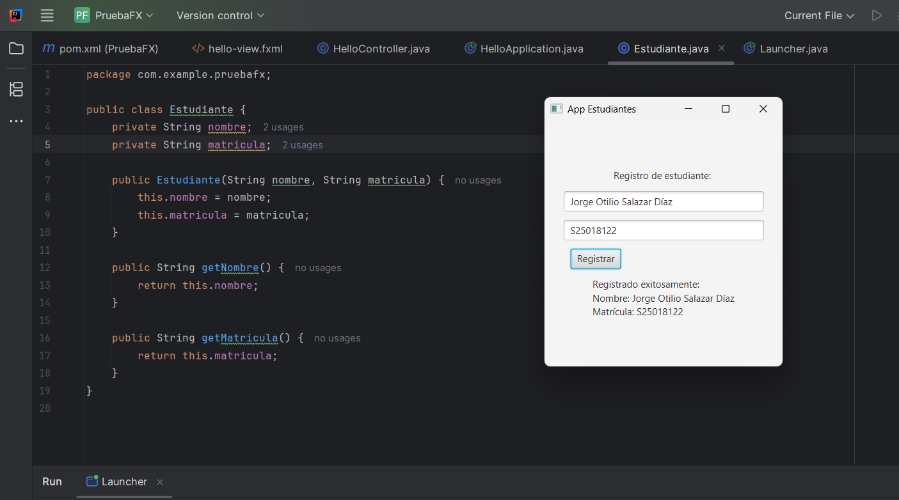

# Conociendo JavaFX desde POO

## Descripción

Práctica realizada con **JavaFX** para crear un registro básico de estudiante mediante una interfaz gráfica.

La aplicación permite ingresar el **nombre** y la **matrícula** de un estudiante y mostrar los datos registrados al presionar el botón correspondiente.

## Funcionamiento

1. El usuario ingresa el nombre del estudiante.
2. Ingresa la matrícula.
3. Presiona el botón **Registrar**.
4. Se crea un objeto de la clase `Estudiante`.
5. Los datos del estudiante se muestran en la ventana.

## Estructura principal

* `Estudiante.java`: contiene los atributos, constructor y métodos para obtener los datos del estudiante.
* `HelloApplication.java`: inicia la aplicación JavaFX.
* `HelloController.java`: controla los elementos de la interfaz y el evento del botón.
* `hello-view.fxml`: contiene el diseño de la interfaz gráfica.

## Objetivo

Practicar el uso de **JavaFX**, eventos, controles gráficos y la integración de una clase de Java con una interfaz gráfica.

### Evidencia de la práctica

## ¿Qué ventaja tiene usar una clase Estudiante en lugar de manejar todo directamente desde los TextField? Menciona 2 elementos de POO utilizados...
> La ventaja es que la clase Estudiante permite organizar y representar los datos del estudiante como un objeto, separando los datos de la interfaz gráfica. Esto hace que el código sea más ordenado y fácil de modificar o reutilizar.
2 conceptos de POO utilizados:
> - Encapsulamiento: los atributos nombre y matricula son privados y se accede a ellos mediante métodos get.
> - Abstracción: la clase Estudiante representa solamente las características necesarias de un estudiante, como su nombre y matrícula.

### Información extra

> Desarrollado por: **Jorge Otilio Salazar Díaz**.
>> Diseño y Programación Orientada a Objetos
